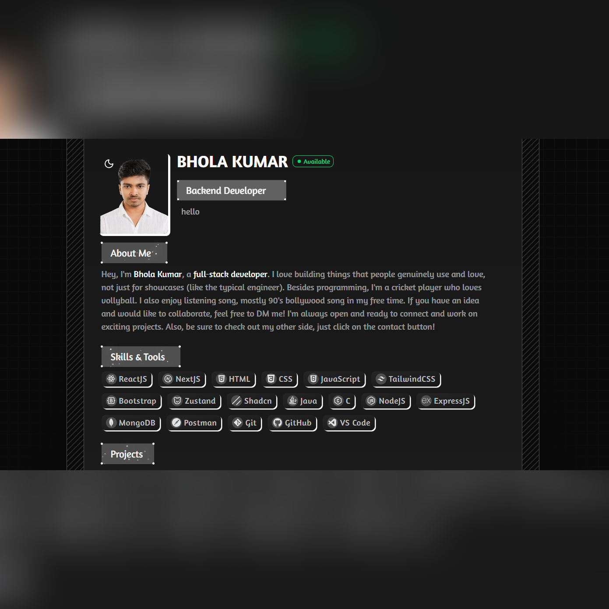

# 🚀 Personal Portfolio Website

A modern, responsive portfolio website built with **Next.js 15**, **TypeScript**, **Tailwind CSS**, and **shadcn/ui**. Showcases my projects, skills, and professional experience with a clean, animated design.



## ✨ Features

- **Modern Tech Stack**: Built with Next.js 15, TypeScript, and Tailwind CSS
- **Responsive Design**: Fully responsive across all devices
- **Dark/Light Mode**: Toggle between themes with smooth transitions
- **Interactive Animations**: Engaging UI animations and hover effects
- **Performance Optimized**: Fast loading with Next.js optimizations
- **SEO Ready**: Optimized for search engines
- **Type Safe**: Full TypeScript support throughout

## 🛠️ Tech Stack

### Frontend
- **Next.js 15** - React framework for production
- **TypeScript** - Type-safe JavaScript
- **Tailwind CSS** - Utility-first CSS framework
- **shadcn/ui** - Beautiful, accessible components
- **Framer Motion** - Animation library

### Development
- **ESLint** - Code linting
- **PostCSS** - CSS processing
- **Vercel** - Deployment platform

## 📁 Project Structure

```
portfolio/
├── src/
│   ├── app/                 # Next.js app directory
│   │   ├── (main)/         # Main pages
│   │   ├── globals.css     # Global styles
│   │   └── layout.tsx      # Root layout
│   ├── components/         # React components
│   │   ├── page/          # Page-specific components
│   │   ├── navbar/        # Navigation components
│   │   ├── ui/            # shadcn/ui components
│   │   └── ...            # Other components
│   ├── hooks/             # Custom React hooks
│   └── lib/               # Utility functions
├── public/
│   ├── project/           # Project screenshots
│   ├── icons/            # Technology icons
│   └── profileImg.jpg    # Profile image
├── components.json        # shadcn/ui config
├── next.config.ts        # Next.js configuration
├── tailwind.config.js    # Tailwind configuration
└── tsconfig.json         # TypeScript configuration
```

## 🎨 Sections

### 1. **Hero Section**
- Eye-catching introduction with animated background
- Professional profile image
- Call-to-action buttons

### 2. **About Section**
- Personal introduction and background
- Professional summary
- Key achievements

### 3. **Skills Section**
- Technology stack showcase
- Proficiency levels
- Categorized skills (Frontend, Backend, Tools)

### 4. **Experience Section**
- Professional work history
- Role descriptions and achievements
- Timeline format

### 5. **Projects Section**
- Featured projects showcase
- Project descriptions and technologies used
- Live demo and GitHub links
- Screenshots and details

### 6. **Contact Section**
- Contact form
- Social media links
- Email integration

## 🚀 Getting Started

### Prerequisites

- Node.js 18+ 
- npm/yarn/pnpm/bun package manager

### Installation

1. **Clone the repository**
   ```bash
   git clone https://github.com/bh-fsdev/portfolio.git
   cd portfolio
   ```

2. **Install dependencies**
   ```bash
   npm install
   # or
   yarn install
   # or
   pnpm install
   # or
   bun install
   ```

3. **Run the development server**
   ```bash
   npm run dev
   # or
   yarn dev
   # or
   pnpm dev
   # or
   bun dev
   ```

4. **Open your browser**
   Navigate to [http://localhost:3000](http://localhost:3000)

## 🎯 Customization

### Personal Information
Update your personal details in the relevant components:
- `src/components/page/About.tsx` - About section content
- `src/components/page/Contact-us.tsx` - Contact information
- `src/components/navbar/*` - Navigation items

### Projects
Add your projects in:
- Update project data in the Projects component
- Add project screenshots to `public/project/`
- Update project descriptions and technologies

### Skills
Modify your skills in:
- Update skill data in the Skills component
- Add new technology icons to `public/icons/`

### Experience
Update your work experience:
- Modify experience data in the Experience component
- Add company logos if needed

## 🎨 Color Scheme

The portfolio uses a consistent color scheme that adapts to light/dark mode:

- **Primary**: Blue tones for CTAs and highlights
- **Secondary**: Gray tones for text and backgrounds
- **Accent**: Purple/pink for special elements

## 📱 Responsive Design

The portfolio is fully responsive with breakpoints:
- **Mobile**: 320px - 768px
- **Tablet**: 768px - 1024px
- **Desktop**: 1024px+

## 🔧 Available Scripts

- `npm run dev` - Start development server
- `npm run build` - Build for production
- `npm run start` - Start production server
- `npm run lint` - Run ESLint

## 🚀 Deployment

### Deploy on Vercel (Recommended)

1. Push your code to GitHub
2. Import your repository on [Vercel](https://vercel.com)
3. Deploy with zero configuration

### Other Deployment Options

- **Netlify**: Connect your GitHub repo
- **GitHub Pages**: Use GitHub Actions
- **Docker**: Build and deploy with Docker

## 📊 Performance

- **Lighthouse Score**: 95+ across all metrics
- **First Contentful Paint**: < 1.5s
- **Time to Interactive**: < 3.5s
- **Cumulative Layout Shift**: < 0.1


## 📞 Contact

- **Email**: [Email](mailto:bholakumar1990kp@gmail.com)
- **LinkedIn**: [LinkedIn](https://linkedin.com/in/bh-fsdev)
- **GitHub**: [GitHub](https://github.com/bh-fsdev)
- **Twitter**: [Twitter](https://twitter.com/bh_fsdev)

## 📄 License

This project is open source and available under the [MIT License](LICENSE).

## 🤝 Contributing

Contributions are welcome! Please feel free to submit a Pull Request.

---

Made with ❤️ by Bhola
